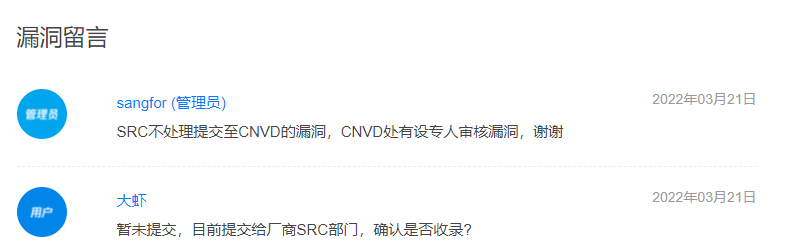
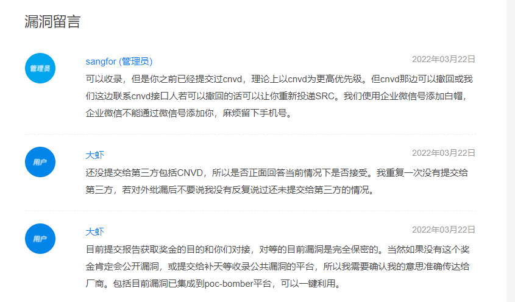
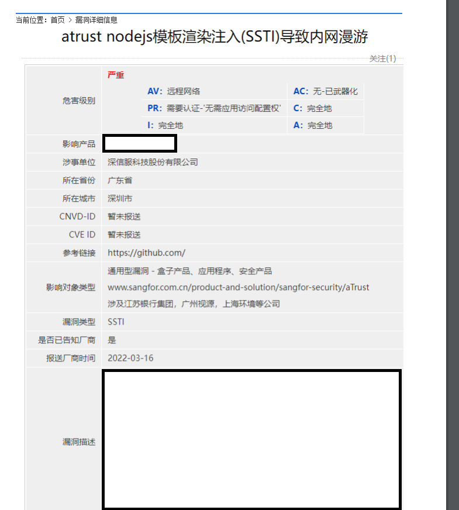

# DaxiaGeGe
漏洞概念证明及利用工具，分享一些0day和HW工具和漏洞挖掘技术

边界-中间件:

* 零信任 aTrust
  * SSTI漏洞内网漫游 (0day)(NFT), DaXia-20220315 (POC放出)
  * 后台配置接口RCE (0day), DaXia-20220324  (POC制作中...)

* VPN
  * SSTI漏洞内网漫游 (0day), DaXia-20220322 (POC放出)

# DaXia-20220315
## 描述
### 时间线
* 对接深信服
* 问题纰漏 <- now
* 按照合法合规途径提交第三方收录者

### 问题概要

<a href="DaXia-20220315/report/atrust SSTI.pdf" download>下载问题简报</a>
* 仅需配置有某功能权限的登陆者通过本漏洞对内部防护网络实现可达
* 利用SSTI， 即服务端模板渲染实现

### 问题影响
* 当前验证 <= 2.1.17
* 国外: https://hackerone.com/reports/878779 Critical (9 ~ 10)
* 国内: https://mp.weixin.qq.com/s/LFXwsfdkY-Ie-kB5ttA-Vg 2021 蚂蚁集团SRC  活动范围：全域 活动时间内所有漏洞与情报双倍奖励 核心业务且有回显SSRF：5万
* 国内: https://mp.weixin.qq.com/s/d1Z_NH3GMtiH-x92UvHgRg 2020 阿里巴巴SRC 活动范围：全域 凡是有回显的SSRF漏洞，若应用属于核心网段，即可获得2万元额外奖励
* 一句话，在旧的安全架构下，内网网络边界显得格外重要，在新技术“零信任”在实现边界模糊化的过程中，边界模糊不代表边界不重要，而是通过更多的认证和可信校验是的模糊变得可控，本漏洞在访问受防护网络时，可以不留下日志信息防止溯源等，在没有应用访问权限的前提下对内部和设备自身进行任意访问。

## POC

<a href="DaXia-20220315/poc/poc.mp4" download>下载POC视频</a>

## EXP

<a href="DaXia-20220315/exp/exp.py" download>下载EXP</a>

* 联系我获取解密密码
* NFT(科学)(购买会有Unlockable Content, 内置有密码): https://opensea.io/assets/0x495f947276749ce646f68ac8c248420045cb7b5e/5484157785966387378797750576508633173204309757965735598615850201050421133313/
* NFT图片有密码

## 杂事
本问题尝试和厂商对接，似乎在玩捉迷藏。

反复说过本问题未向任何人或机构纰漏， SRC的人就一定要说我向CNVD提交过，作为国内的top安全厂商这是什么情况？？

不收就不收，承担纰漏后果即可，为什么一定要说我已经提交给第三方，非常困惑？

近期会在本项目放出视频 POC， 看厂商动作。

后续提交补天和CNVD， 本漏洞已武器化，可以一键利用，再纰漏EXP。

提交两次漏洞均告知我提交CNVD，我都懵逼状态，我只是用了CNVD的本地模板。

# DaXia-20220322
## 描述
### 时间线
* POC纰漏 <- now
* 披露EXP

### 问题概要
* 传统的边界产品下的边界突破漏洞，和DaXia-20220315有共性

### 问题影响
* 当前验证 <= 7.2.8R2
* 突破边界，规避日志溯源
* 操作内部接口，实现RCE

## POC
(VPN_SSTI_TO_SSRF_bandicam 2022-03-25 11-23-14-368.mp4)

<a href="DaXia-20220322/poc/poc.mp4" download>下载POC视频</a>

## EXP

<a href="DaXia-20220322/exp/exp.py" download>下载EXP</a>

* 联系我获取解密密码

# DaXia-20220324
## 描述
### 时间线
* POC纰漏 <- now
* 披露EXP

### 问题概要
* 某功能使用的组件存在可以RCE的方法，组件非常热门，但是估计他们并不知道不能这样用~~
  
### 问题影响
* RCE，通过界面获取设备权限

## POC

## EXP

* 联系我获取解密密码
